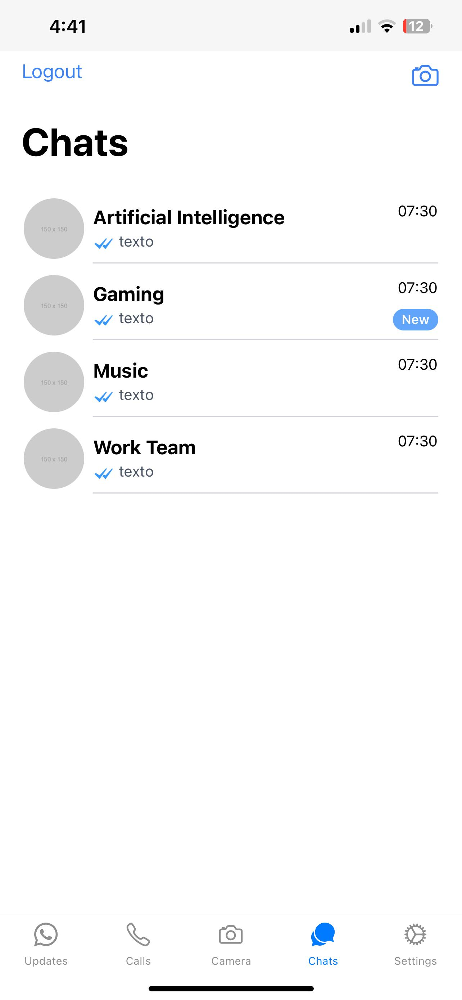

# Whatsapp Clone App with React Native

A real-time chat application developed in React Native that utilizes the backend provided by [adrielgro](https://github.com/adrielgro/chat-room-node-vue3-ts-graphql).

## Description

This application allows you to log in with your name, access different chat rooms, and engage in real-time conversations with other users. It is based on the project [Chat Room Node Vue3 TS GraphQL](https://github.com/adrielgro/chat-room-node-vue3-ts-graphql) developed by adrielgro.

## Features

- Login with a username.
- Participation in multiple real-time chat rooms.
- Real-time conversations with other users.

## Screenshots
 

## Installation

1. **Follow the steps of the repository below and start the backend:**
   [](https://github.com/adrielgro/chat-room-node-vue3-ts-graphql)

2. **Clone this repository to your local machine:**
   ```bash
   git clone https://github.com/azael20/realtime-whatsapp-clone.git
   
3. **Install Dependencies**:
   - Open a terminal in the project directory.
   - Run the following command to install all the necessary dependencies:
     ```bash
     yarn install

2. **Start the Application**:
   - Ensure you have your emulator or device ready to run the application.
   - Run the following command to start the project using [Expo]:
     ```bash
     npx expo start

      That's it! Your application should be up and running, ready for testing.
